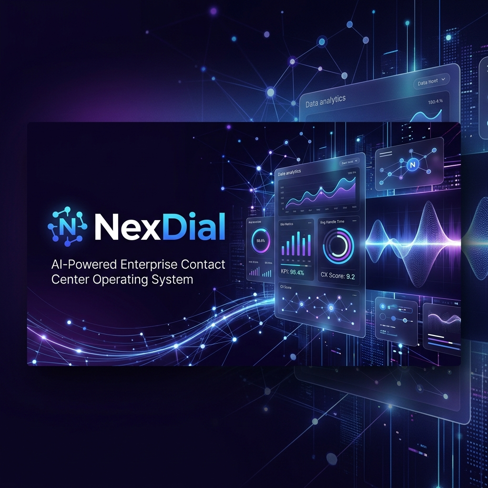
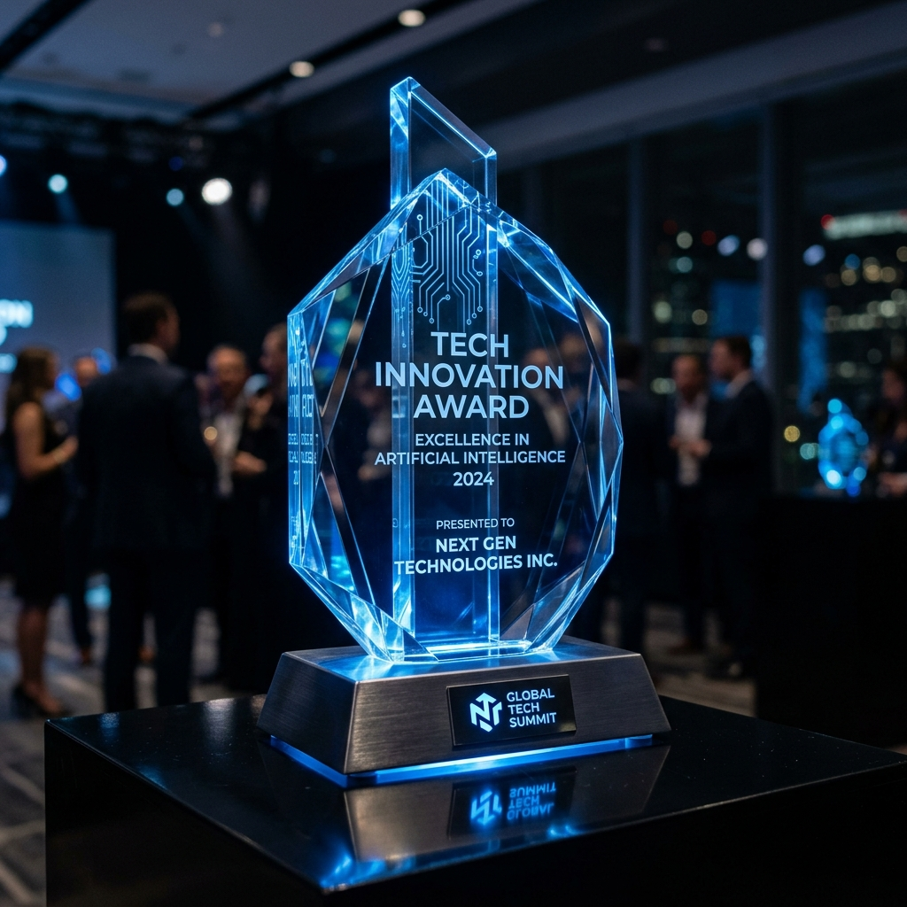

  

  # NexDial
  ### AI-Powered Enterprise Contact Center & CRM Operating System
  
  
  
  

  ---

  

    NexDial is a next-generation, cloud-native <b>Contact Center Operating System (CCOS)</b> and <b>Intelligent CRM</b> built for modern enterprises. It integrates advanced lead pipelines, customizable industry workflows, real-time voice AI agents, and specialized operational modules into a single, unified visual dashboard.
  

 

## 🌟 Key Capabilities

<table width="100%" border="0" cellpadding="10" cellspacing="0">
  <tr>
    <td width="50%" valign="top">
      <h3>🚀 Dynamic CRM System</h3>
      
Supports 50+ pre-configured industries (Healthcare, Real Estate, Manufacturing, and more). Instantly seeds industry-specific lead stages and workflow automations during workspace onboarding.

    </td>
    <td width="50%" valign="top">
      <h3>📞 Unified Dialer Operations</h3>
      
Advanced predictive pacing, power, progressive, and preview dialing modes coupled with a WebRTC-based browser softphone, live supervisor HUD, and real-time audio meters.

    </td>
  </tr>
  <tr>
    <td width="50%" valign="top">
      <h3>🤖 Conversational Voice AI</h3>
      
Streamlined real-time speech-to-text transcriptions during live calls. Dynamically injects RAG SOP documentation and scripts directly onto the agent's screen based on client context.

    </td>
    <td width="50%" valign="top">
      <h3>🏬 Specialized Industry Modules</h3>
      
Fully integrated operational tools like a live Restaurant POS console featuring visual table layouts, digital orders, bill settlement, and role-based staff access.

    </td>
  </tr>
</table>

 

## 🏆 Key Recognitions & Awards

<table width="100%" border="0" cellpadding="10" cellspacing="0">
  <tr>
    <td width="30%" align="center" valign="middle">
      
    </td>
    <td width="70%" valign="middle">
      <h3>Tech Innovation Award — Excellence in Artificial Intelligence</h3>
      
<strong>Presented by the Global Tech Summit</strong>

      
Recognized for outstanding innovation in applying real-time conversational AI models, semantic RAG-based knowledge lookup, and highly concurrent enterprise-grade CCOS (Contact Center Operating System) architectures.

    </td>
  </tr>
</table>

 

## 🛠️ Unified Technology Stack

We leverage a cutting-edge tech stack to guarantee sub-millisecond response times, absolute data isolation, and exceptional user experiences.

  
  
  
  
  
  
  
  

 

## 🔒 Enterprise-Grade Security & Infrastructure

Our architecture is built for maximum reliability, compliance, and strict multi-tenancy:
- **Tenant Isolation**: Secure database schema-level isolation using strict tenant `workspaceId` context.
- **Secure WebRTC**: Call paths are fully encrypted using SRTP and DTLS to protect voice communications.
- **Access Control**: Hardened role-based access control (RBAC) backed by secure OAuth 2.0 and JWT tokens.
- **Connection Optimization**: PostgreSQL pooling configurations optimized for high-concurrency websocket streams.

 

## 📁 Active Projects & Repositories

- 🌐 [Core Platform (Nexdial-IO)](https://github.com/sabledattatray/Nexdial-IO) — The main application repository hosting the dashboard, CRM pipelines, POS module, and dialer console.

---

  
© 2026 Nexdial. All rights reserved.

  
Engineered for High Performance by <a href="https://dattasable.com">Datta Sable</a>.

